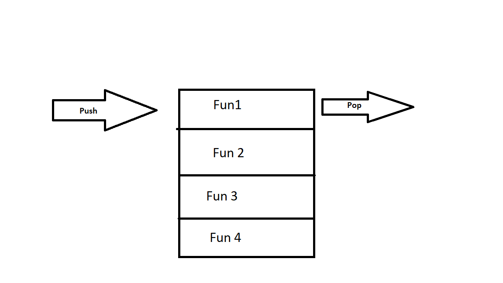

# In memory storage

## What is a ‘call’?
The call stack is primarily used for function invocation (call). Since the call stack is single, function(s) execution, is done, one at a time, from top to bottom. It means the call stack is synchronous.

## How many ‘calls’ can happen at once?
one call only can happen at once. The stack is synchronous.

## What does LIFO mean?
which works based on the last-in, first-out

## Draw an example of a call stack and the functions that would need to be invoked to generate that call stack.

## What causes a Stack Overflow?

The most-common cause of stack overflow is excessively deep or infinite recursion, in which a function calls itself so many times that the space needed to store the variables and information associated with each call is more than can fit on the stack.

## What is a ‘refrence error’?
The ReferenceError object represents an error when a non-existent variable is referenced.

## What is a ‘syntax error’?
are mistakes in the source code, such as spelling and punctuation errors, incorrect labels, and so 

## What is a ‘range error’?
A RangeError is thrown when trying to pass a value as an argument to a function that does not allow a range that includes the value

## What is a ‘type error’?
The TypeError object represents an error when an operation could not be performed, typically (but not exclusively) when a value is not of the expected type.

## What is a breakpoint?
A breakpoint is a point in the program where the code will stop executing

## What does the word ‘debugger’ do in your code?
Debugging tools (called debuggers) are used to identify coding errors at various development stages.

